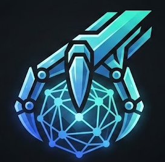
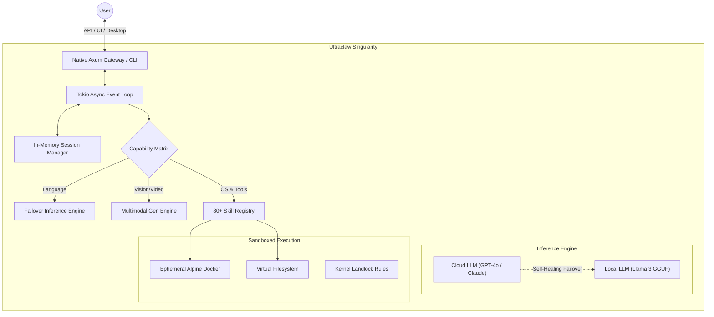

<div align="center">
  
  
  # Ultraclaw 🦀

  **The Ultimate Autonomous AI Agent Framework**

  <p>
    <a href="https://nishal21.github.io/Ultraclaw/"></a>
    <a href="https://github.com/nishal21/Ultraclaw/actions"></a>
    <a href="https://github.com/nishal21/Ultraclaw/releases/latest"></a>
    
    
  </p>

  *A hyper-optimized, zero-overhead multimodal autonomous AI agent written in natively compiled Rust. Seamlessly bridging local execution, cloud intelligence, and absolutely secure OS sandboxing.*
</div>

---

## 🚀 Why Ultraclaw?

Ultraclaw is not just another wrapper script. It is a compiled, lightning-fast native binary that lives at the OS layer. It replaces fragile Python setups with a **Zero-Overhead** Rust execution context.

<table>
  <tr>
    <td width="33%">
      <h3>🛡️ Absolute Sandboxing</h3>
      <p>Native Linux Landlock and ephemeral Alpine Docker containers prevent agents from harming the host filesystem. Execute any command securely.</p>
    </td>
    <td width="33%">
      <h3>🧠 Multimodal Engine</h3>
      <p>Direct integration with 15+ Image and Video AI providers (DALL-E, Stability, Veo, Luma) routing strictly via dynamic API keys.</p>
    </td>
    <td width="33%">
      <h3>⚡ Triple Threat UI</h3>
      <p>Shipped natively with a keyboard-driven Rust TUI, a completely native Desktop wrapper (Tauri), and a gorgeous React Web Canvas.</p>
    </td>
  </tr>
  <tr>
    <td width="33%">
      <h3>🌐 Omnichannel Presence</h3>
      <p>Natively bridges 18+ platforms including Slack, Discord, Telegram, Teams, and standard Webhooks concurrently. One brain, everywhere.</p>
    </td>
    <td width="33%">
      <h3>🤖 Advanced Agent Swarms</h3>
      <p>Deploy unlimited sub-agents simultaneously. Hand off massive tasks to Nano-Git resolving swarms while you continue discussing architecture.</p>
    </td>
    <td width="33%">
      <h3>🎙️ Omni-Voice Processing</h3>
      <p>Directly bind to hardware microphones using built-in Whisper engines. Speak to your cloud infrastructure naturally.</p>
    </td>
  </tr>
</table>

---

## 🏗️ System Architecture

Ultraclaw functions as a highly modular "Brain". Its core is an async event loop that processes messages via `tokio`, manages contextual state, and intelligently routes over **80 built-in skills**.



---

## 🛠️ Instant Installation

Follow these zero-overhead steps to get the Agent Singularity running natively on your hardware.

### Universal Dependencies

| Component | Installation Command |
| :--- | :--- |
| **Rust Toolchain** | `curl --proto '=https' --tlsv1.2 -sSf https://sh.rustup.rs | sh` |
| **System Libs (Ubuntu)** | `sudo apt install build-essential libssl-dev pkg-config` |
| **Node.js (For UI)** | `npm i -g npm@latest` |

### 1. Clone & Core Compile

Compiling with `--release` enables LTO (Link-Time Optimization) and heavily strips debug symbols for maximum performance.

```bash
git clone https://github.com/nishal21/Ultraclaw.git
cd Ultraclaw
cargo build --release
```

### 2. Multi-UI Execution

Choose how you want to interact with your Agent perfectly suited to your workflow.

```bash
# Option A: Start the stunning lightweight Terminal Interface (TUI)
cargo run --release -- --tui

# Option B: Boot the Local API Gateway & visually rich React Canvas UI
cargo run --release &
cd docs && npm install && npm run dev
```

---

## ⚙️ Universal Global Configuration

Configuration is hierarchal: `Environment Values` > `config.json` > `.env file`. We support **any LLM provider globally** out of the box.

```env
# -----------------------------
# CORE INFERENCE ENGINE
# -----------------------------
ULTRACLAW_CLOUD_API_KEY=sk-xxxx
ULTRACLAW_CLOUD_MODEL=gpt-4o
ULTRACLAW_CLOUD_BASE_URL=https://api.openai.com/v1

# Local Testing overrides:
# ULTRACLAW_CLOUD_BASE_URL=http://localhost:11434/v1
# ULTRACLAW_CLOUD_MODEL=llama3

# -----------------------------
# PLATFORM BRIDGES
# -----------------------------
ULTRACLAW_DISCORD_TOKEN=your_bot_token_here
ULTRACLAW_TELEGRAM_TOKEN=your_bot_token_here

# -----------------------------
# MULTIMODAL GENERATION 
# -----------------------------
ULTRACLAW_STABILITY_API_KEY=sk-xxxx
ULTRACLAW_RUNWAY_API_KEY=sk-xxxx
```

---

## 🖥️ Continuous Integration / Matrix

This repository natively builds binaries for **Windows, macOS, Linux, and Android APKs** using GitHub Actions upon every single push to the `main` branch. 

Check the [Downloads Hub](https://nishal21.github.io/Ultraclaw/downloads) or the [Releases](https://github.com/nishal21/Ultraclaw/releases) tab for pre-compiled payloads, including the native `.apk` to run Swarms directly from your phone.

---

<div align="center">
  <h3>Built with 🦀 and ❤️ by Nishal</h3>
  <p>Available completely Open-Source under the MIT Protocol.</p>
</div>

